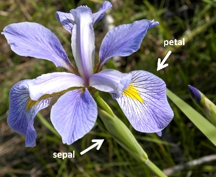

```{r echo = FALSE, message = FALSE, warning = FALSE}
library(ggplot2)
library(dplyr)
library(ggfortify)
```

## Introduction

This is an **R Markdown** script for the practical *Introduction to Statistics in R*. In the script, we will cover:

* How to use R Markdown
* How to carry out the following statistical tests:
    + Chi-squared test;
    + Two sample t-test;
    + Linear regression.
    
Code can be embedded in the document:

```{r iris}
head(iris)
```

Or code can be run inline e.g. Two plus two equals `r 2+2`.

Here is a plot of iris Sepal.Length vs. Sepal Length:

```{r echo = F, results = "hide", fig.width = 4, fig.height = 3}
data(iris)
str(iris)
ggplot(iris, aes(x = Sepal.Length, y = Sepal.Width, col = Species)) + 
  geom_point()
```

## Chi-squared test

Here we examine the differences in the frequency of red and black ladybirds (*Adalia bipunctata*) in rural and industrial habitats. Our question is: are dark morphs more likely to reside in dark (industrial) backgrounds? The null hypothesis is that there is no association between ladybird colour morph and habitat type.

```{r echo = F, results = "hide", message=F}

ladybirds <- read.csv("data/ladybirds.csv", header = T)
glimpse(ladybirds)

totals <- group_by(ladybirds, Habitat, morph_colour)
totals <- summarise(totals, total.number = sum(number))
totals

lady.mat <- xtabs(number ~ Habitat + morph_colour, data = ladybirds)
lady.mat

chisq.test(lady.mat)

lady.chisq <- chisq.test(lady.mat)

names(lady.chisq)
str(lady.chisq)

lady.chisq$statistic
lady.chisq$p.value

```

Ladybird colour morphs were not equally distributed in the two habitats (Chi-Squared = `r lady.chisq$statistic`, df = `r lady.chisq$parameter`, P = `r lady.chisq$p.value`), with black morphs occurring more frequently in industrial habitats and red morphs more frequently in rural habitats (Figure 1).

```{r echo = F}
ggplot(totals, aes(x = Habitat, y = total.number, fill = morph_colour)) +
  geom_col(position = "dodge") +
  scale_fill_manual(values = c(black = "black", red = "red"))

```

## Two-sample t-test

Here, we will use data from two *Iris* species, *I. virginica* and *I. versicolor* to determine if their sepal lengths are significantly different (Figure 2). The null hypothesis is that there is no significant different between the means in each species.




First, we will visualise the data with a boxplot and a histogram:

```{r echo = F, results = "hide", fig.width = 4, fig.height = 4}
sepals <- read.csv("data/iris.edited.csv", header = T)
glimpse(sepals)

# boxplot
ggplot(sepals, aes(Species, Sepal.Length)) + geom_boxplot()

#histogram with facet_wrap
ggplot(sepals, aes(Sepal.Length)) +
  geom_histogram(binwidth = 0.25) +
  facet_wrap(~Species, ncol = 1)

sepal.test <- t.test(Sepal.Length ~ Species, data = sepals)
sepal.test

str(sepal.test)

```

Sepal lengths in *Iris virginica* were significantly higher than in *I.versicolor* (Welch two sample t-test, t = `r sepal.test$statistic`, df = `r sepal.test$parameter`, P = `r sepal.test$p.value`).


## Linear Regression

Here, we use Francis Galton's human height dataset from 1886 to determine if daughter ault height varies relative to the mean height of her parents. Our null hypothesis is that mid-parental height is not correlated with daughter adult height.

```{r echo = F, results = "hide", warning=F}

heights <- read.csv("data/Galton.csv", header = T)
head(heights)
dim(heights)

heights <- filter(heights, sex == "F")
dim(heights)

ggplot(heights, aes(x = mid.parent, y = height)) +
  geom_point() +
  labs(x = "Mid-parental height", y = "Daughter height")

```

We will examine this relationship using a linear regression.

```{r}

lm.heights <- lm(height ~ mid.parent, data = heights)
autoplot(lm.heights)
lm.heights
summary(lm.heights)

```

The regression line is fit on the plot:

```{r echo = F}
ggplot(heights, aes(x = mid.parent, y = height)) +
  geom_point() +
  stat_smooth(method = "lm") +
  labs(x = "Mid-parental height", y = "Daughter height")

```

```{r echo = F, results = "hide"}
summary.lm.heights <- summary(lm.heights)$coefficients
```

In the Galton dataset, for each unit increase in mid-parental height, there is an increase in daughter height by 0.72 inches (slope = `r summary.lm.heights[2,1]`, t = `r summary.lm.heights[2,3]`, df = `r lm.heights$df.residual`, P = `r 2.405692e-34`)
